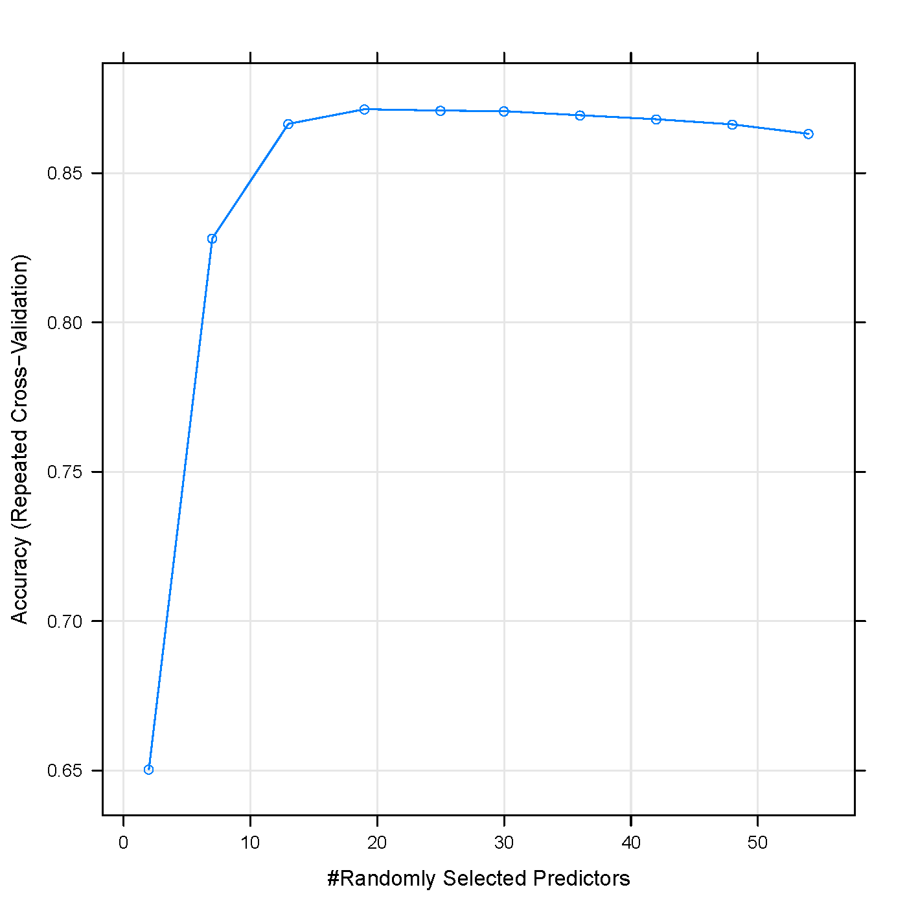
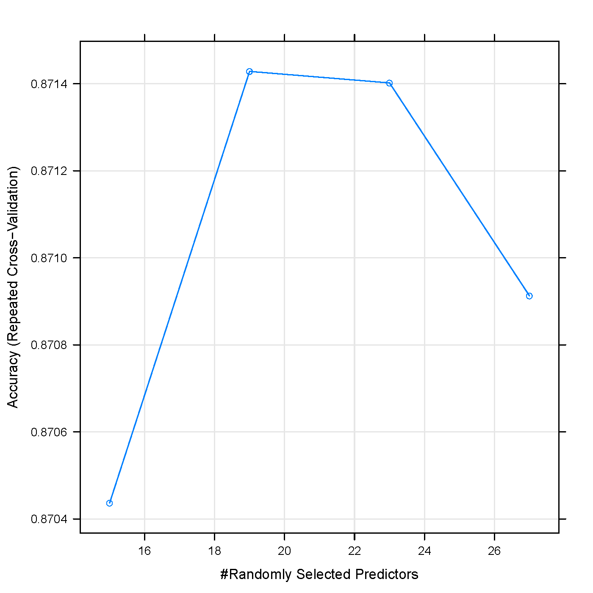
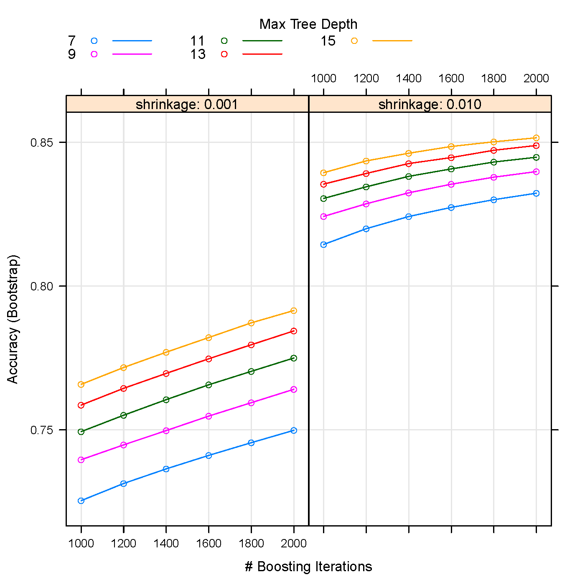
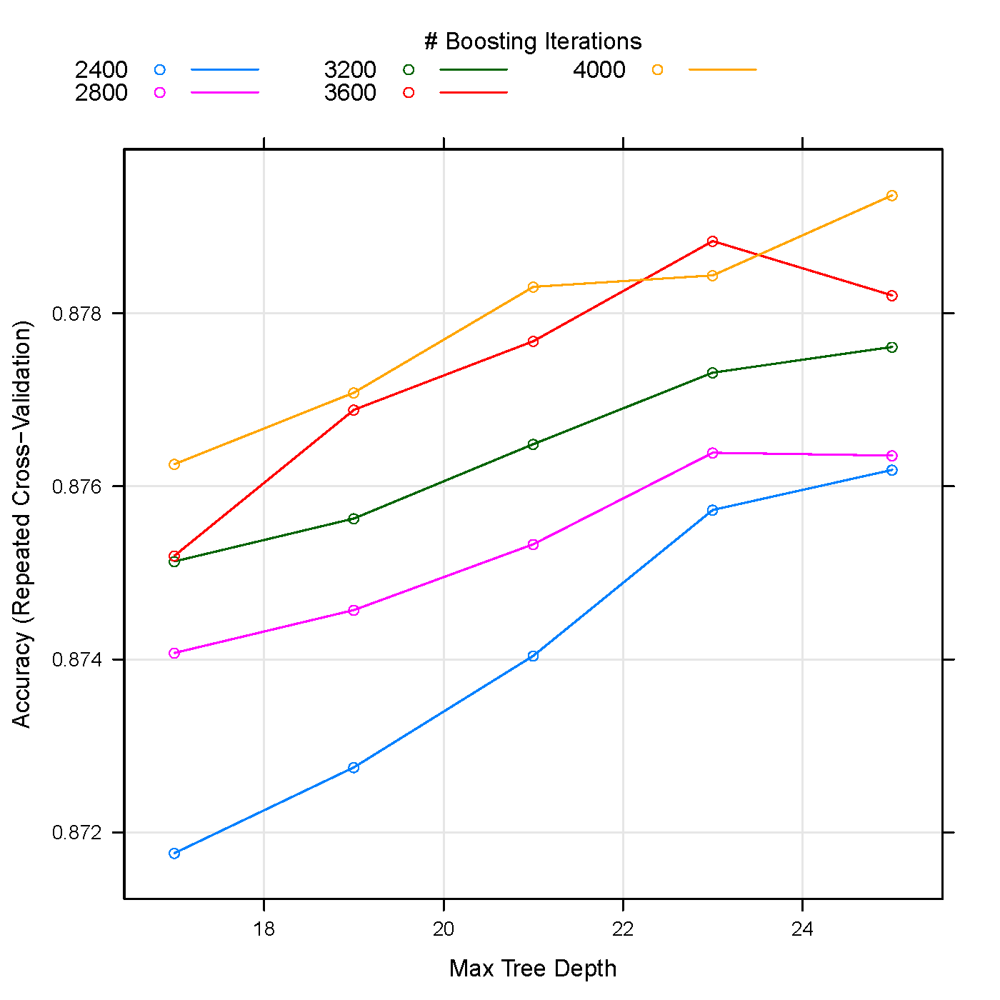
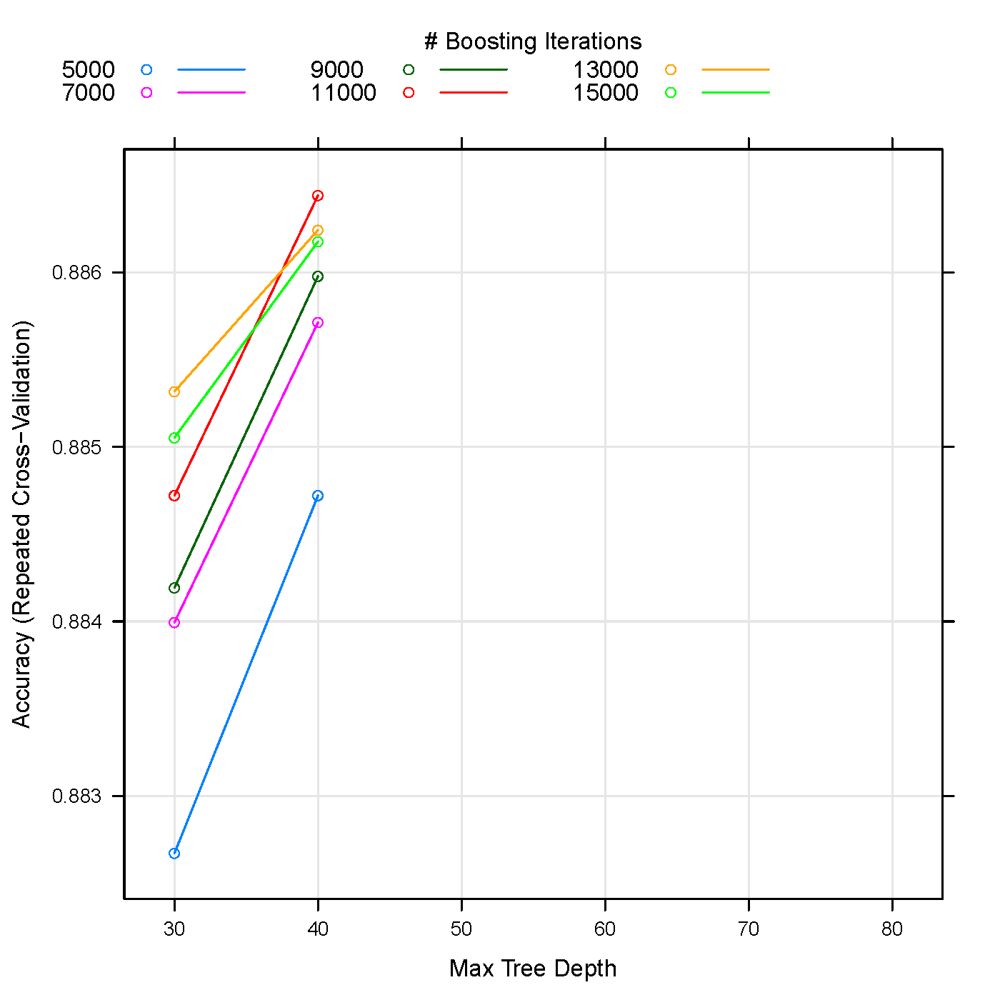
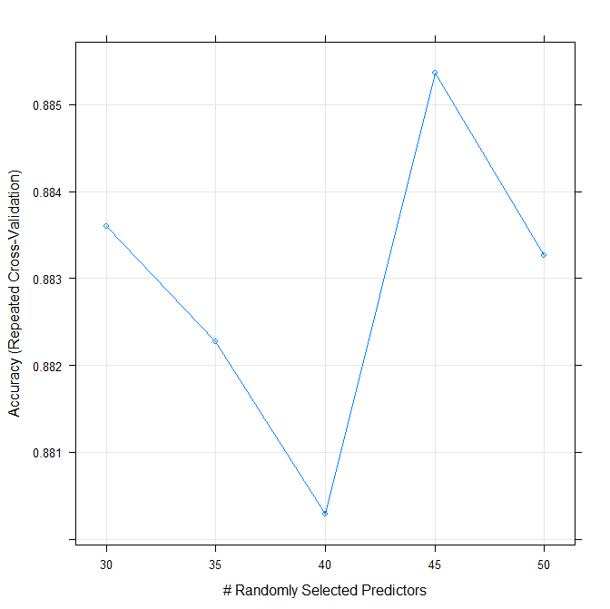

```r
# load library caret
library('caret')

# load training and testing dataset
training <- read.csv('train.csv',header=T,row.names=1)
testing <- read.csv('test.csv',header=T,row.names=1)

# pre-examine the dataset
dim(training)
dim(testing)
colnames(training)
with(training,table(Cover_Type))

# propertion of NA for each feature
NA_prop <- sapply(training,function(i) {sum(is.na(i))/length(i)})
table(NA_prop)

# Propertion of missing values for each feature 
Missing_prop <- sapply(training,function(i) {sum(i=='')/length(i)})
table(Missing_prop)

# Convert Cover_Type to start with 'C', treated as factors(characters)
training$Cover_Type <- as.factor(paste('C',training$Cover_Type,sep=''))

# Try to scale the parameters
# But exclude dummy variables
train_subset2 <- training[,1:10]

# features with zero variance 
nzv <- nearZeroVar(train_subset2)

# scale to zero mean and 1 sd
mean_subset2 <- apply(train_subset2,2,mean)
sd_subset2 <- apply(train_subset2,2,sd)
train_subset2_scaled <- sweep(train_subset2,2,mean_subset2,'-')
train_subset2_scaled <- sweep(train_subset2_scaled,2,sd_subset2,'/')
training_scaled <- training
training_scaled[,1:10] <- train_subset2_scaled

# find features with high correlation 
corMat <- cor(train_subset2_scaled)
Highcorr <- findCorrelation(corMat,cutoff = 0.9)

# find linear combination 
LinearComb <- findLinearCombos(train_subset2_scaled)

# scale the testing dataset by using the mean and sd from training examples
testing_subset <- testing[,1:10]
testing_subset_scaled <- sweep(testing_subset,2,mean_subset2,'-')
testing_subset_scaled <- sweep(testing_subset_scaled,2,sd_subset2,'/')
testing_scaled <- testing
testing_scaled[,1:10] <- testing_subset_scaled

# remove certain features with low or 0 counts as dummy variables
training_scaled_sel <- training_scaled[,-c(21,22,29,39)]
testing_scaled_sel <- testing_scaled[,-c(21,22,29,39)]

# instead of dummy variable, also try factor variable (feature)
Wilderness <- factor(c(paste('wilder',1:4,sep='')))
Soiltype <- factor(c(paste('soil',1:40,sep='')))
train_subset <- training[,15:54]
train_subset1 <- training[,11:14]
index_soil <- apply(train_subset,1,function(i) which(i==1))
index_wild <- apply(train_subset1,1,function(i) which(i==1))
training_trans <- training[1:10]
training_trans$Wild <- Wilderness[index_wild]
training_trans$Soil <- Soiltype[index_soil]
training_trans[,1:10] <- train_subset2_scaled
training_trans$Cover_Type <- training$Cover_Type

# also transform the testing dataset
testing_trans <- testing_subset_scaled
testing_subset1 <- testing[,15:54]
testing_subset2 <- testing[,11:14]
index_soil <- apply(testing_subset1,1,function(i) which(i==1))
index_wild <- apply(testing_subset2,1,function(i) which(i==1))
testing_trans$Wild <- Wilderness[index_wild]
testing_trans$Soil <- Soiltype[index_soil]

# train using random forest

t1 <- Sys.time()
registerDoMC(cores=4)
set.seed(1990)
modelfit_rf_class<-train(Cover_Type~.,method='rf',data=training_scaled,
                          trControl = trainControl(method = "repeatedcv", 
                                                   savePred=F, classProb=F,
                                                   repeats=3), 
                          importance=T,ntree=1000, tuneLength=10)
t2 <- Sys.time()
t2-t1

# take a look at the accuracy 
plot(modelfit_rf_class)
```



```r
# try rf with smaller range of values 
t1 <- Sys.time()
registerDoMC(cores=4)
set.seed(1990)

# construt the paramter grid for tuning 
rf_tuneGrid <- expand.grid(.mtry= 17:21)
modelfit_rf_class4<-train(Cover_Type~.,method='rf',data=training_scaled_sel,
                          trControl = trainControl(method = "repeatedcv", 
                                                   repeats=5), 
                          ntree=1000, tuneGrid=rf_tuneGrid)
t2 <- Sys.time()
t2-t1
# mtry = 18 is best 
```



```{r}
# use rf to train(mtry=18) , but extract probability and prediction,
# without cross validation
t1 <- Sys.time()
registerDoMC(cores=20)
set.seed(1990)
rf_tuneGrid <- expand.grid(.mtry= 18)
modelfit_rf_class13<-train(Cover_Type~.,method='rf',data=training_scaled_sel,
                          trControl = trainControl(method = "repeatedcv", 
                                                   repeats=1,
                                                   savePred=T,
                                                   classProb=T), 
                          ntree=3000, tuneGrid=rf_tuneGrid)
t2 <- Sys.time()
t2-t1
```

```r
# use gbm to train 
gbmGrid <- expand.grid(.interaction.depth = seq(30,80, by=10),
                       .n.trees = seq(5000,15000,by=2000),
                       .shrinkage =  0.01)
t1 <- Sys.time()
registerDoMC(cores=4)
set.seed(1990)
modelfit_gbm_dummy3 <- train(Cover_Type~., data=training_scaled_sel,
                             method = "gbm",
                             tuneGrid = gbmGrid,
                             trControl = trainControl(method = "repeatedcv",  
                                                      repeats = 1),
                             ## The gbm() function produces copious amounts
                             ## of output, so pass in the verbose option
                             ## to avoid printing a lot to the screen
                             verbose = F)
t2 <- Sys.time()
t2-t1
```







```{r}
# use gbm to train again, but extract classpred and classprob 
gbmGrid <- expand.grid(.interaction.depth = 45,
                       .n.trees = 11000,
                       .shrinkage =  0.01)
t1 <- Sys.time()
registerDoMC(cores=20)
set.seed(1990)
modelfit_gbm_dummy3 <- train(Cover_Type~., data=training_scaled_sel,
                             method = "gbm",
                             tuneGrid = gbmGrid,
                             trControl = trainControl(method = "repeatedcv",  
                                                      repeats = 1,
                                                      savePred=T,
                                                      classProb=T),
                             ## The gbm() function produces copious amounts
                             ## of output, so pass in the verbose option
                             ## to avoid printing a lot to the screen
                             verbose = F)
t2 <- Sys.time()
t2-t1
```


```r
# use extratrees to train 
# set numrandomcuts =1 
options(java.parameters="-Xmx6g")
library('rJava')
library('extraTrees')
extratreesGrid <- expand.grid(.mtry=seq(5,50, by=5),
                              .numRandomCuts=1)
t1 <- Sys.time()
registerDoMC(cores=20)
set.seed(1990)
modelfit_extratrees <- train(Cover_Type~., data = training_scaled_sel,
                         trControl = trainControl(method = 'repeatedcv',
                                                  repeats=1),
                         method = "extraTrees", 
                         ntree = 3000, 
                         tuneGrid = extratreesGrid) 
t2 <- Sys.time()
t2-t1
```


```r
# use extratrees to train again, but extract prob and pred
options(java.parameters="-Xmx8g")
library('rJava')
extratreesGrid <- expand.grid(.mtry=45,
                              .numRandomCuts=1)
t1 <- Sys.time()
#registerDoMC(cores=4)
set.seed(1990)
modelfit_extratrees1 <- train(Cover_Type~., data = training_scaled_sel,
                         trControl = trainControl(method = 'repeatedcv',
                                                  repeats=1,
                                                  savePred=T),
                         method = "extraTrees", 
                         ntree = 3000, 
                         tuneGrid = extratreesGrid) 
t2 <- Sys.time()
t2-t1
```



```{r}
# using the prob from rf and gbm as features to train the model again 
ensemble1 <- cbind(modelfit_rf_class13$pred[,3:9], modelfit_gbm_dummy3$pred[,3:9], modelfit_rf_class13$pred$pred, modelfit_gbm_dummy3$pred$pred, extratrees_train$pred)
colnames(ensemble1) <- c(paste('C',1:7,'rf', sep=''), paste('C',1:7,'gbm', sep=''), 'rf_pred','gbm_pred',
                         'extratrees_pred')
ensemble1$obs <- modelfit_rf_class13$pred$obs

t1 <- Sys.time()
registerDoMC(cores=40)
set.seed(1990)
rf_tuneGrid <- expand.grid(.mtry= seq(2, 6, by = 2))

modelfit_rf_type<-train(obs~.,method='rf',data=ensemble1,
                         trControl = trainControl(method = "repeatedcv", 
                                                  repeats=1),
                        ntree=3000, 
                         tuneGrid=rf_tuneGrid)
t2 <- Sys.time()
t2-t1

t1 <- Sys.time()
registerDoMC(cores=20)
testing_gbm_prob <- predict(modelfit_gbm_dummy3, testing_scaled_sel,type='prob')
testing_rf_prob <-predict(modelfit_rf_class13, testing_scaled_sel,type='prob')

testing_gbm <- predict(modelfit_gbm_dummy3, testing_scaled_sel)
testing_rf <-predict(modelfit_rf_class13, testing_scaled_sel)

t2 <- Sys.time()
t2-t1

ensembel_test <- cbind(testing_rf_prob, testing_gbm_prob,testing_rf, testing_gbm, testing_extratrees)
colnames(ensembel_test) <- c(paste('C',1:7,'rf', sep=''), paste('C',1:7,'gbm', sep=''),
                             'rf_pred','gbm_pred','extratrees_pred')

testing_ensembel <- predict(modelfit_rf_type, ensembel_test)

temp <- substr(testing_ensembel,2,2)
temp <- matrix(temp, nrow = length(temp), ncol = 1)
temp <- cbind(rownames(testing),temp)
colnames(temp) <- c('Id','Cover_type')
write.csv(temp,'testing_ensembel.csv',row.names=F,quote=F)

############### accuracy 0.79139


testing_extratrees <- predict(modelfit_extratrees, testing_scaled_sel)
testing_final <- testing_gbm
testing_final[testing_extratrees=='C2'] <- 'C2'
testing_final[testing_extratrees=='C1'] <- 'C1'


```
# use gbm , then substitute 'C1' and 'C2' from extratrees, then table C2 from emsembel1_test, then assign C1 C2 to the combined ensembel 

